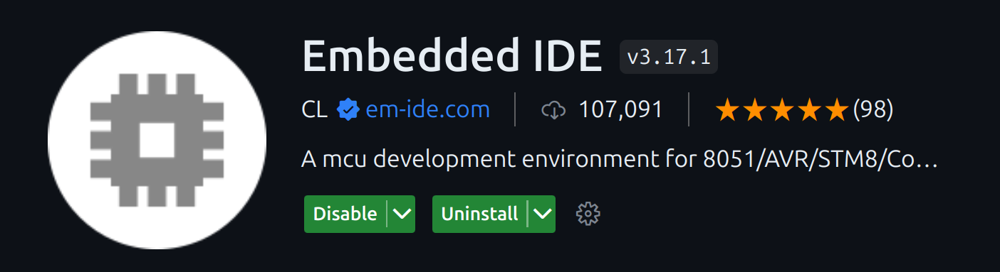
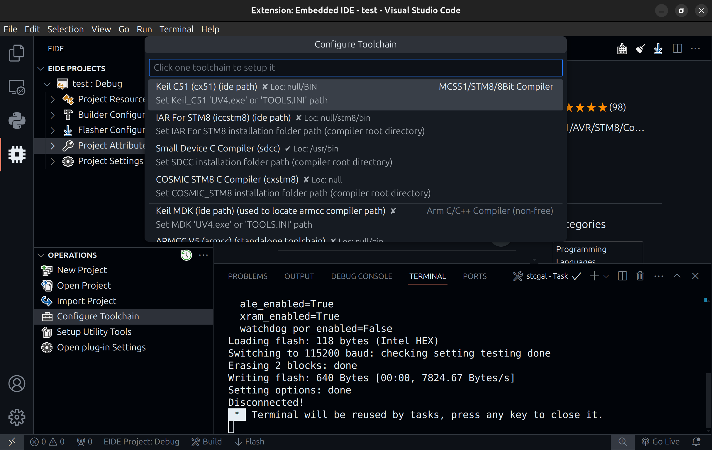
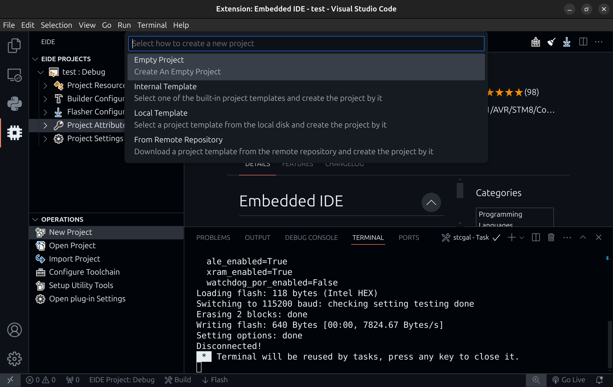
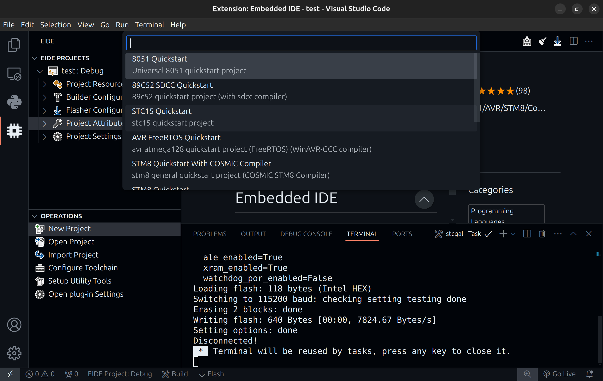
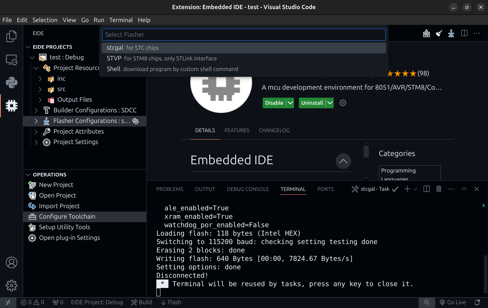
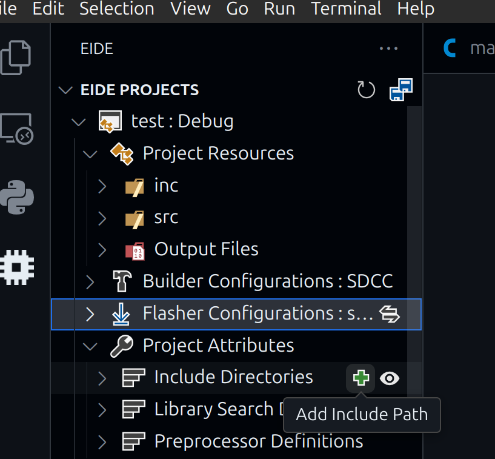

# 在Ubuntu24上搭建51单片机开发环境

## 概述

这里使用的是`sdcc`编译器，`stcgal`烧录工具，并在`VS Code`中使用`Enbedded IDE`插件搭建集成开发环境。

这里就以我的`STC89C52RC`为例

## sdcc

直接输入以下命令安装即可

```bash
sudo apt-get install sdcc
```

然后查看版本号验证是否安装成功

```bash
sdcc -v
```

## stcgal

该仓库描述使用命令`pip3 install stcgal`安装，但由于Ubuntu24需要使用Python来实现一些功能，为了防止pip与系统的其它包管理工具发生冲突，使用该命令会报错

```bash
$ sudo pip3 install please-cli
error: externally-managed-environment

× This environment is externally managed
╰─> To install Python packages system-wide, try 'pacman -S
    python-xyz', where xyz is the package you are trying to
    install.

    If you wish to install a non-Arch-packaged Python package,
    create a virtual environment using 'python -m venv path/to/venv'.
    Then use path/to/venv/bin/python and path/to/venv/bin/pip.

    If you wish to install a non-Arch packaged Python application,
    it may be easiest to use 'pipx install xyz', which will manage a
    virtual environment for you. Make sure you have python-pipx
    installed via pacman.

note: If you believe this is a mistake, please contact your Python installation or OS distribution provider. You can override this, at the risk of breaking your Python installation or OS, by passing --break-system-packages.
hint: See PEP 668 for the detailed specification.
```

一个不错的解决方法就是使用pipx代替pip3

```bash
pipx install stcgal
```

> 您在上面看到的涉及手动工作。Pipx 使其自动化。
> 
> 它会自动为您安装的每个应用程序创建一个新的虚拟环境。不仅。它还在 中创建指向它的链接.local/bin。这样，安装该软件包的用户就可以从命令行中的任何位置运行它。
> 
> 我想这就是大多数桌面 Linux 用户想要的。
> 
> 引自：[pip(3) install，完美解决 externally-managed-environment - 耀龙笔记](https://www.yaolong.net/article/pip-externally-managed-environment/)

## Enbedded IDE

就是这个



设置sdcc的bin目录所在位置

`Configure Toolchain -> Smail Device C Compiler (sdcc)`



新建一个项目

`New Project -> Internal Template -> 89C52 SDCC Quickstart`





设置项目的Builder为sdcc，Flasher为stcgal




最后把工作空间的源文件和头文件的文件夹添加到里面

我这里就添加了`inc`和`src`



这样代码编写生成烧录都可以在VS Code中完成了

## 问题解决

### 问题1:生成时发现找不到dotnet工具

错误如下

```bash
A fatal error occurred. The required library libhostfxr.so could not be found.
If this is a self-contained application, that library should exist in [/home/ru/.dotnet/tools/.store/dotnet-ef/6.0.2/dotnet-ef/6.0.2/tools/netcoreapp3.1/any/].
If this is a framework-dependent application, install the runtime in the global location [/usr/share/dotnet] or use the DOTNET_ROOT environment variable to specify the runtime location or register the runtime location in [/etc/dotnet].

The .NET runtime can be found at:
  - https://aka.ms/dotnet-core-applaunch?missing_runtime=true&arch=x64&rid=arch-x64&apphost_version=6.0.2
```

可以去微软找Ubuntu24的dotnet安装教程

如dotnet8

安装sdk

```bash
sudo apt-get update && \
  sudo apt-get install -y dotnet-sdk-8.0
```

安装runtime

```bash
sudo apt-get update && \
  sudo apt-get install -y aspnetcore-runtime-8.0
```

最后修改你的终端配置文件，在文件结尾加上

```
# Netcore
export PATH=$PATH:$HOME/.dotnet/tools
export DOTNET_ROOT=$HOME/.dotnet
export PATH=$PATH:$DOTNET_ROOT
```

### 问题2:烧录出现无法访问

给予权限

```bash
sudo chmod a+rw /dev/ttyUSB0
```

如果还是不行就修改CH340驱动

驱动所在目录

```bash
/lib/modules/$(uname -r)/kernel/drivers/usb/serial
```

如果存在ch341文件则将其删除

```bash
sudo rm -rf ch341.ko.zst
```

下载文件并解压，解压后会有一个`c`文件

[[CH341SER_LINUX.ZIP - 南京沁恒微电子股份有限公司](https://www.wch.cn/download/CH341SER_LINUX_ZIP.html)]

然后查看内核版本号并到[这里](https://elixir.bootlin.com/linux/v5.8/source/drivers/usb/serial/ch341.c)复制对应版本号的代码粘贴到`ch341.c`中

```bash
uname -r
```

然后在该`c`文件所在文件夹下make一下得到`ko`文件

```bash
make 。
```

再将该`ko`文件复制到驱动文件所在目录下

```bash
sudo cp ./*.ko /lib/modules/$(uname -r)/kernel/drivers/usb/serial
```
